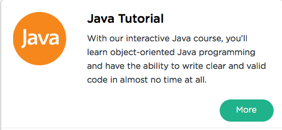

```
Roberto Nogueira  
BSd EE, MSd CE
Solution Integrator Experienced - Certified by Ericsson
```
# Sololearn Java



**About This Tutorial**

Learn all of the fundamentals of Java, and have fun while doing it – with SoloLearn!

[Sololearn Java](https://www.sololearn.com/Course/Java/)

#### Topics
```
Ruby Tutorial
[x] Basic Concepts
[x] Conditional and Loops
[x] Arrays
[x] Classes and Objects
[x] More on Classes
[ ] Exception, Lists, Threads & Files
[ ] Certificate
```

